# Waris — kalkulator pembagian warisan Islam

Website statis untuk menghitung pembagian warisan menurut syariat Islam, dalam bahasa
Indonesia sehari-hari. Dibangun dengan Flavida Design System.

Aturan waris dalam Islam sudah baku dan tertutup — ditetapkan dalam QS An-Nisa ayat 11, 12,
dan 176 serta sejumlah hadits sahih, dan tidak pernah berubah sejak diturunkan. Yang membuat
orang awam tidak bisa memakainya bukan ketidakjelasan aturannya, tapi aritmatikanya: pecahan
yang harus dijumlahkan, tabel hijab (siapa menggugurkan siapa), dan belasan kasus khusus.
Website ini menutup celah itu.

---

## Tampilannya

Semua tangkapan layar di bawah diambil dari aplikasi yang berjalan, bukan mockup.

### Halaman utama

Animasi demo berjalan sendiri di hero — satu kasus contoh dihitung dari nol sampai selesai,
supaya pengunjung paham cara kerjanya tanpa membaca teks panjang. Latar geometri Islami
menandakan bahwa aturan yang dipakai di sini khusus untuk muslim.

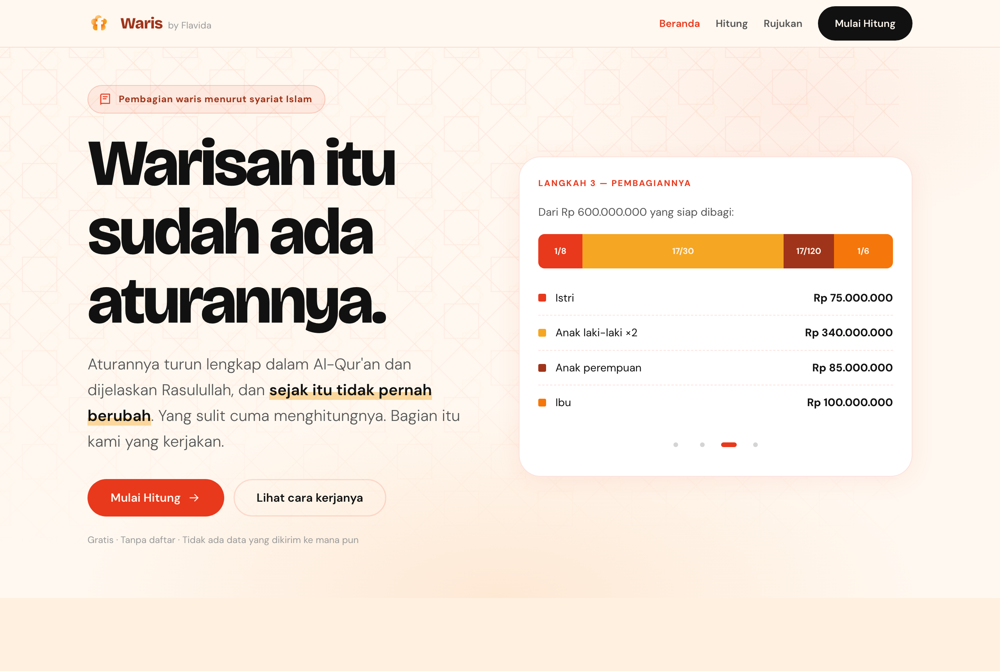

### Dua cara mengisi ahli waris

Cara cepat: daftar centang dan tombol +/−. Cocok untuk keluarga yang sederhana susunannya.

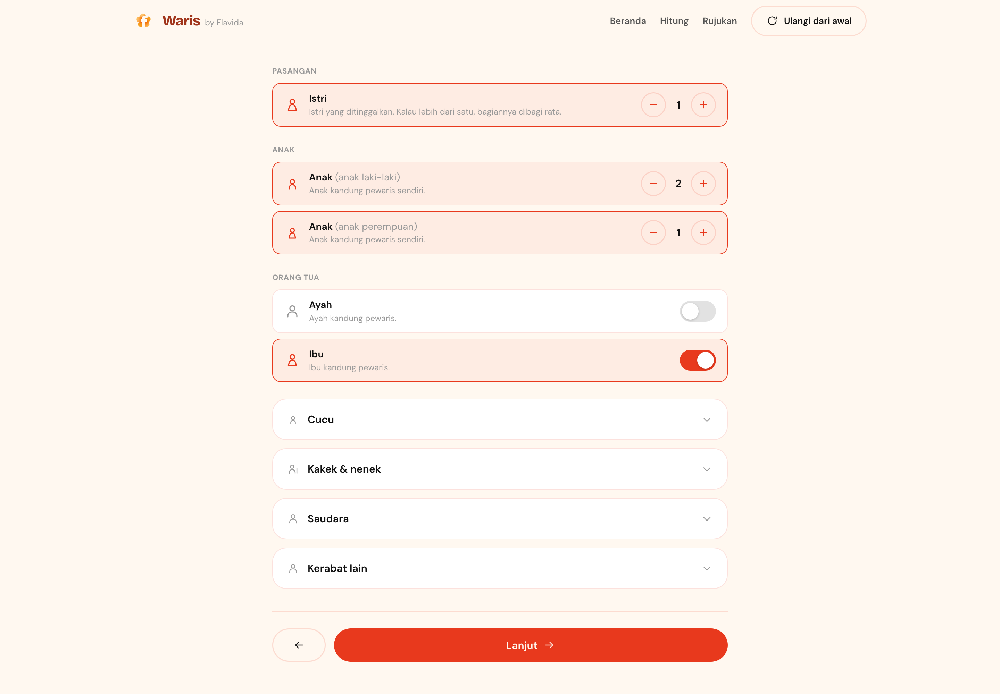

Cara akurat: susun pohon keluarganya seperti aslinya. Cucu ditambahkan dari dalam kartu
anaknya, keponakan dari dalam kartu saudaranya — jadi hubungan antar orang tidak perlu
ditebak oleh mesinnya. Ini yang membedakan cucu lewat anak laki-laki (mewarisi) dari cucu
lewat anak perempuan (tidak mewarisi).

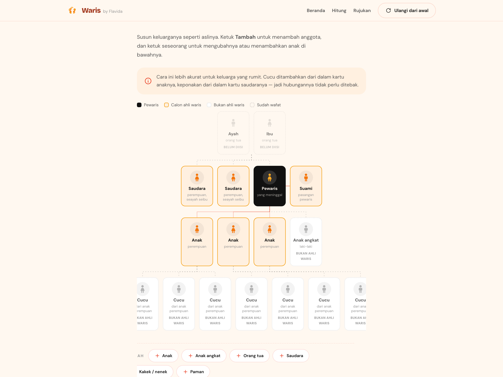

### Hasil perhitungan

Harta dipotong dulu sesuai urutan dalam QS An-Nisa: biaya pengurusan jenazah, hutang, lalu
wasiat. Baru sisanya dibagi. Donutnya menampilkan proporsi tiap pihak beserta nominal
rupiahnya.

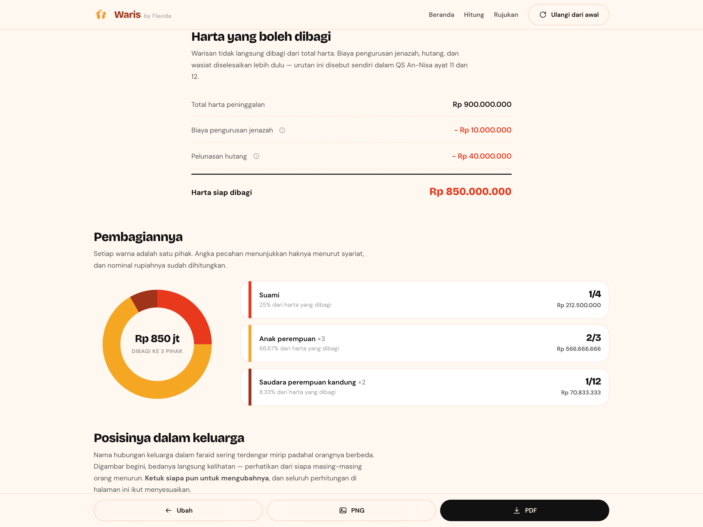

### Pohon keluarga dengan hasilnya

Pecahan dan nominal ditempelkan langsung ke orangnya. Yang tidak kebagian tetap ditampilkan
lengkap dengan alasannya — anak angkat dan cucu lewat anak perempuan bukan ahli waris,
dan itu terlihat jelas alih-alih hilang diam-diam.

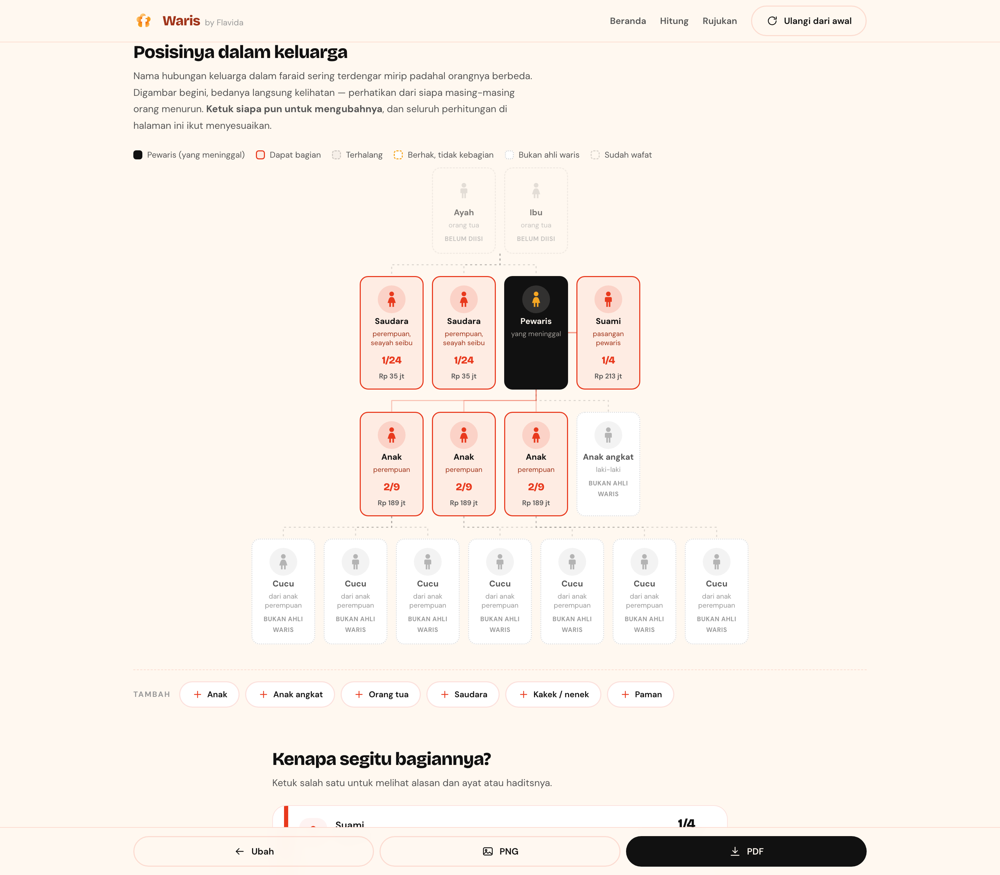

Ketuk siapa pun untuk mengubah jenis kelamin, keadaan, status, atau menambahkan anak di
bawahnya. Seluruh perhitungan di halaman langsung dihitung ulang.

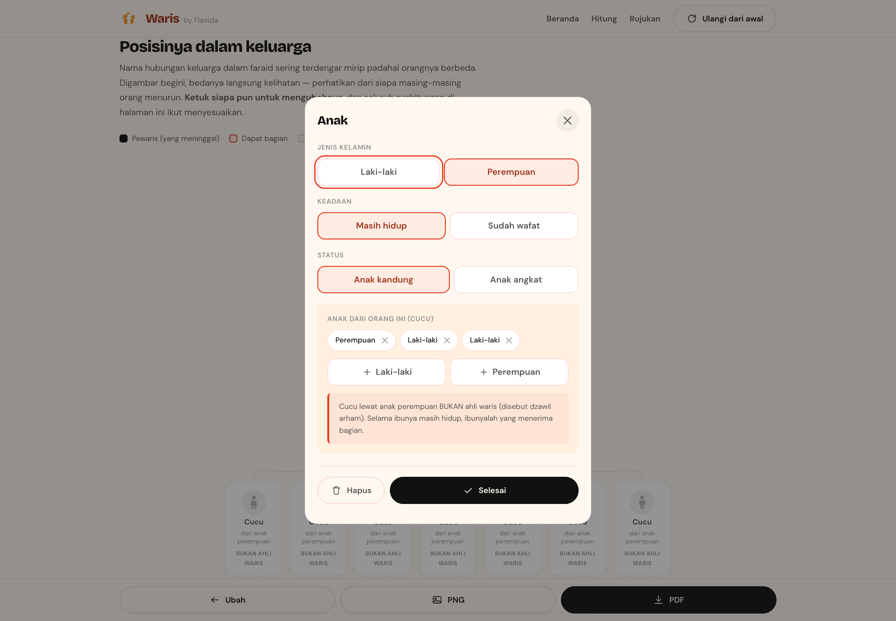

### Dalil untuk setiap angka

Tiap bagian bisa dibuka untuk melihat alasannya, teks Arab ayat atau haditsnya, terjemahan,
derajat kesahihan, dan tautan ke sumber daring yang bisa diperiksa sendiri.

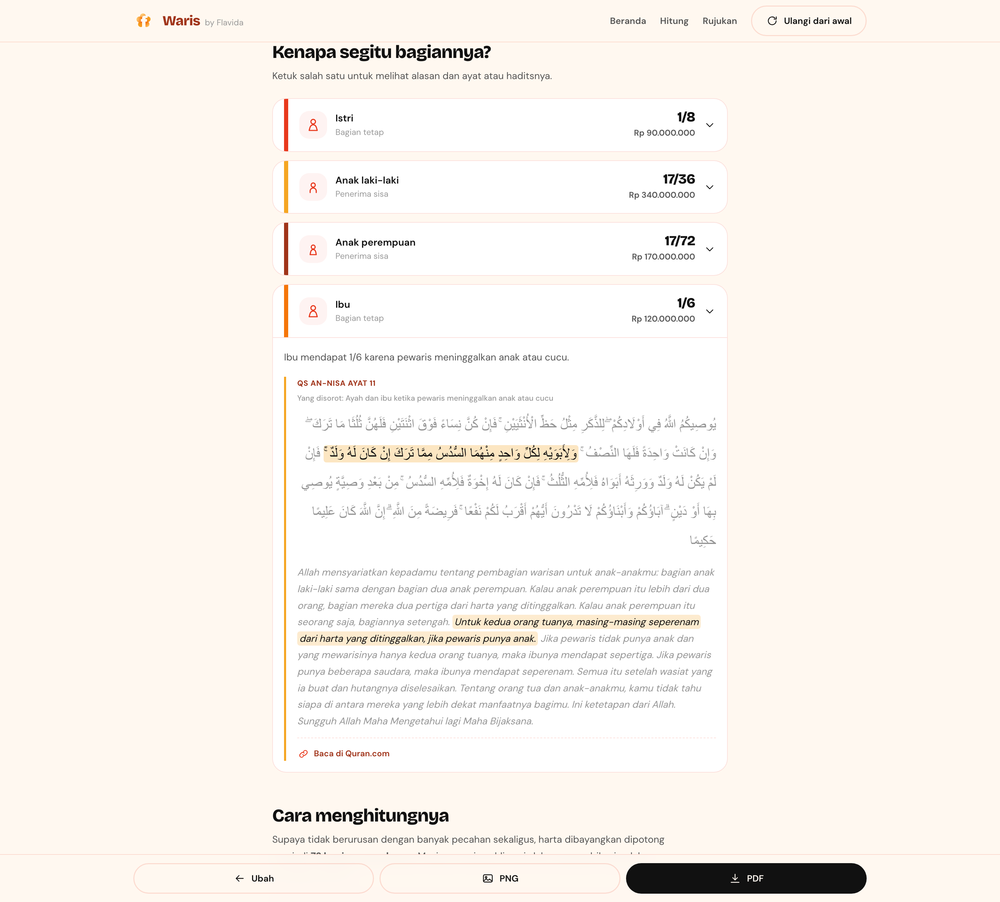

### Langkah selanjutnya

Angka saja belum menyelesaikan urusan. Ada checklist yang menyesuaikan kondisi keluarganya —
dokumen yang perlu diurus, lembaga yang perlu didatangi, dan mana yang wajib didahulukan.

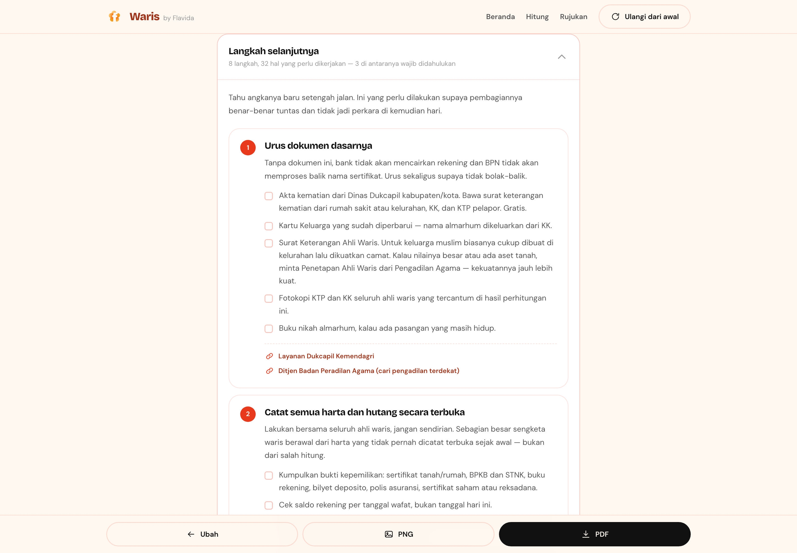

### Halaman rujukan

Seluruh ayat dan hadits yang dipakai kalkulator ini dikumpulkan di satu halaman, lengkap
dengan takhrij dan tautan ke hadits.id serta Qur'an digital.

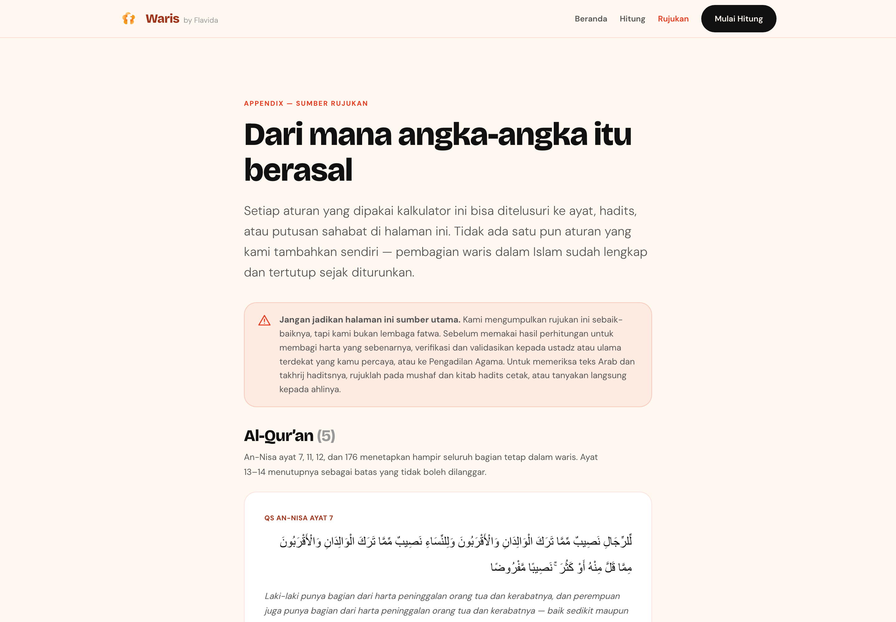

### Mobile

Dirancang mobile-first — inilah tampilan yang dipakai sebagian besar pengunjung.

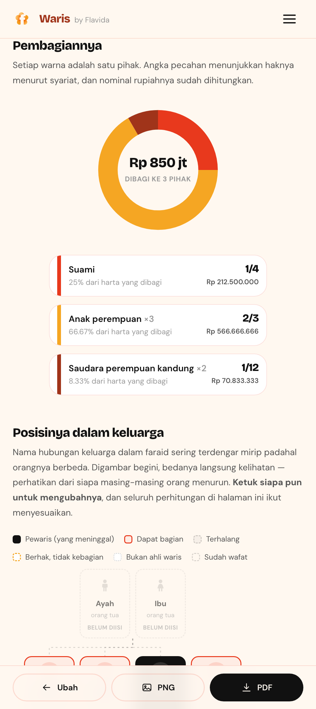

### Uji mesin faraid

`tests.html` menjalankan 97 kasus yang jawabannya sudah baku dalam kitab faraid. Kalau ada
satu saja yang merah, hasil kalkulator tidak boleh dipercaya.

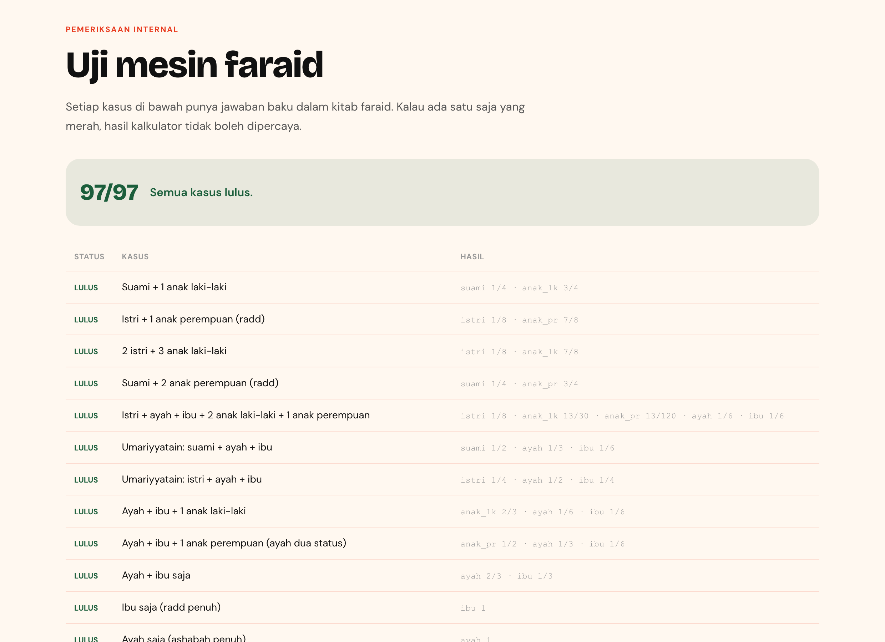

---

## Menjalankan

Tidak ada build step, tidak ada dependency, tidak ada npm.

```bash
python3 -m http.server 8123
```

Lalu buka <http://localhost:8123>. Untuk produksi, unggah seluruh folder ini apa adanya ke
hosting statis mana pun (GitHub Pages, Netlify, Vercel, cPanel).

---

## Struktur

```
index.html              Halaman utama + animasi demo
hitung.html             Wizard input dan hasil
rujukan.html            Appendix — seluruh dalil Al-Qur'an & Hadits
tests.html              Penguji mesin faraid — buka di browser

css/
  tokens.css            Salinan verbatim dari flavida-design-system
  base.css              Reset, nav, footer, tombol, kartu
  app.css               Wizard, donut, ledger, kartu hasil
  print.css             Tata letak cetak / Simpan sebagai PDF

js/faraid/              Mesin perhitungan — murni, tanpa sentuhan DOM
  fraction.js           Aritmatika pecahan bilangan bulat
  heirs.js              Definisi 23 ahli waris
  hijab.js              Aturan penghalang
  shares.js             Bagian tetap (ashabul furudh)
  ashabah.js            Pembagian sisa harta
  special.js            Umariyyatain, Akdariyyah, Musyarakah, kakek-vs-saudara
  estate.js             Tirkah: harta bersama, biaya jenazah, hutang, wasiat
  solve.js              Orkestrator + 'aul + radd + konversi rupiah

js/
  dalil.js              Dataset ayat & hadits (statis, dianalisa sekali)
  khi.js                Catatan Kompilasi Hukum Islam
  advice.js             Langkah selanjutnya untuk keluarga
  keluarga.js           Model struktur keluarga + penurunan ahli waris
  ui-pohon.js           Diagram pohon keluarga
  ui-pohon-edit.js      Penyuntingan pohon (bilah tambah + lembar ubah)
  ui-*.js               Lapisan tampilan lainnya
  export.js             PNG (canvas) & PDF (dialog cetak)
  tests.js              97 kasus uji
```

## Model susunan keluarga

`js/keluarga.js` menyimpan **struktur** keluarga, bukan angka: cucu menempel pada anak
tertentu, keponakan pada saudara tertentu, sepupu pada paman tertentu. Daftar ahli waris
diturunkan dari struktur itu lewat `keAhliWaris()`.

Ini bukan sekadar kerapian. Contoh nyata yang memicu perubahan ini: seorang ibu wafat
meninggalkan 3 anak perempuan yang masing-masing sudah punya anak. Kalau cucu-cucu itu diisi
ke kolom "cucu", kalkulator menganggapnya cucu lewat anak laki-laki — satu-satunya cucu yang
mewarisi — lalu menyimpulkan almarhumah pernah punya anak laki-laki yang wafat lebih dulu.
Hasilnya salah: cucu kebagian 1/13 dan saudara perempuan tidak kebagian apa-apa, padahal yang
benar cucu tidak berhak sama sekali dan saudara perempuan mendapat 1/12.

Dengan model struktur, cucu lewat anak perempuan digambar apa adanya dan ditandai **bukan
ahli waris**. Hal yang sama berlaku untuk anak angkat, keponakan dari saudara perempuan,
keponakan dari saudara seibu, dan sepupu perempuan.

### Anak tiri, anak angkat, anak kandung

Ketiganya berbeda dan tidak boleh disamakan, karena akibat hukumnya di Indonesia berbeda:

| Status | Mewarisi? | Catatan |
|---|---|---|
| Anak kandung | Ya | Termasuk anak dari pernikahan sebelumnya — nasabnya tidak terputus. |
| Anak tiri | Tidak | Anak bawaan pasangan. Mewarisi dari orang tua kandungnya sendiri. Wasiat wajibah KHI Pasal 209 **tidak** berlaku; jalurnya hibah semasa hidup atau wasiat biasa maksimal 1/3. |
| Anak angkat | Tidak | Pengangkatan tidak memindahkan nasab, tapi KHI Pasal 209 memberi wasiat wajibah maksimal 1/3 lewat Pengadilan Agama. |

### Ayat ditampilkan utuh, klausanya disorot

Satu ayat waris memuat beberapa ketetapan sekaligus. QS An-Nisa 11 mengatur anak, ayah, dan
ibu dalam satu ayat; QS An-Nisa 12 mengatur suami, istri, dan saudara seibu sekaligus.

Aturannya di sini: **ayat tidak pernah dipenggal.** Seluruh ayat selalu ditampilkan sampai
kalimat penutupnya, lalu ruas yang menetapkan bagian orang yang sedang dibaca disorot dan
sisanya dipudarkan. Pembaca tetap melihat firman selengkapnya, tanpa kehilangan petunjuk
bagian mana yang sedang dibicarakan.

Ayat disimpan sebagai deretan ruas di `js/dalil.js`, dan `arab` serta `terjemah` utuhnya
diturunkan dari gabungan ruas itu — jadi tidak mungkin ada dua versi teks yang berbeda.
Ruas yang bukan ketetapan bagian (kalimat penghubung dan penutup ayat) memakai `id: null`:
tetap tampil, tapi tidak pernah menjadi sorotan.

| Ahli waris | Ayat | Ruas yang disorot |
|---|---|---|
| Istri, ada anak | An-Nisa 12 | "…jika kamu punya anak, mereka mendapat seperdelapan" |
| Istri, tanpa anak | An-Nisa 12 | "…seperempat jika kamu tidak punya anak" |
| Ibu, ada anak | An-Nisa 11 | "…masing-masing seperenam, jika pewaris punya anak" |
| Ibu, tanpa anak | An-Nisa 11 | "…maka ibunya mendapat sepertiga" |
| Ibu, ada 2 saudara | An-Nisa 11 | "…jika ia punya beberapa saudara, ibunya seperenam" |
| Anak lk + pr | An-Nisa 11 | "…bagian laki-laki sama dengan dua perempuan" |
| Saudara lk + pr | An-Nisa 176 | "…jika mereka saudara laki-laki dan perempuan…" |

Sebagian bagian bersandar pada **lebih dari satu sumber**, dan keduanya ditampilkan: ayat
menetapkan besarannya, hadits menetapkan mekanismenya. Anak yang mengambil sisa harta
merujuk An-Nisa 11 (perbandingan 2 : 1) **dan** HR Bukhari 6732 (siapa yang mengambil sisa).

Ada juga angka yang memang tidak ada di ayat mana pun dan dinyatakan terus terang sebagai
qiyas — misalnya 1/6 untuk saudara perempuan seayah yang melengkapi 2/3, yang diqiyaskan
pada putusan Ibnu Mas'ud tentang cucu perempuan (HR Bukhari 6736).

Ada kasus uji khusus yang menjaga aturan ini: teks utuh tiap ayat harus benar-benar sama
dengan gabungan seluruh ruasnya, sehingga tidak ada ruas yang bisa hilang diam-diam.

### Dua dasar hukum, dipilih pemakai

Halaman hasil punya pemilih **"Qur'an & Sunnah"** atau **"+ Hukum Indonesia"**. Bawaannya
syariat murni; mencentang harta bersama di langkah 3 otomatis menyalakan mode Indonesia,
karena centang itu memang permintaan eksplisit.

| | Qur'an & Sunnah | + Hukum Indonesia |
|---|---|---|
| Pemisahan harta bersama | Tidak diterapkan | Separuh dikeluarkan lebih dulu |
| Catatan Pengadilan Agama | Disembunyikan | Ditampilkan dengan tautan pasalnya |
| Checklist harta bersama | Disembunyikan | Muncul dengan disclaimer dan sumber |
| Ekspor PNG dan PDF | Ikut mode yang dipilih | Ikut mode yang dipilih |

Angkanya benar-benar berubah, bukan sekadar menyembunyikan teks — itulah gunanya: pemakai
bisa melihat persis apa yang ditambahkan aturan negara.

### Aturan negara: hanya yang berlaku bagi umat Islam

Rujukan utama tetap Al-Qur'an dan sunnah. Aturan negara dicantumkan hanya bila ia memang
aturan bagi umat Islam, dan setiap penyebutannya membawa tautan ke sumber yang bisa dibuka:

| Rujukan | Dipakai untuk |
|---|---|
| [UU 1/1974 Pasal 35](https://pasal.id/peraturan/uu/uu-no-1-tahun-1974#pasal-35) | Definisi harta bersama dan harta bawaan |
| [KHI Pasal 96, 185, 209](https://peraturan.bpk.go.id/Details/293351/inpres-no-1-tahun-1991) | Separuh harta bersama, ahli waris pengganti, wasiat wajibah |
| [UU 3/2006 Pasal 49](https://pasal.id/peraturan/uu/uu-no-3-tahun-2006#pasal-49) | Kewenangan Pengadilan Agama atas perkara waris orang Islam |

Teks pasalnya diverifikasi lewat basis data peraturan resmi, bukan dari ingatan. KHI adalah
lampiran Inpres 1/1991 sehingga tidak terindeks per pasal — kutipannya dicocokkan ke sumber
Ditjen Badilag Mahkamah Agung. **KUHPerdata dan hukum adat tidak dipakai sama sekali.**

### Kerabat yang sudah wafat lebih dulu

Syarat mewarisi adalah ahli warisnya **masih hidup saat pewaris wafat**. Kerabat yang wafat
lebih dulu tidak mewarisi apa pun — tapi ia tidak dihapus dari bagan, karena posisinya masih
menentukan siapa yang naik menggantikannya dalam antrean ashabah:

| Yang wafat lebih dulu | Akibatnya |
|---|---|
| Pasangan | Bukan ahli waris. Anak dari pernikahan itu tetap mewarisi penuh. Yang wafat juga tidak memakan jatah batas 4 istri. |
| Anak laki-laki | Bukan ahli waris, tapi anaknya (cucu lewat anak laki-laki) naik menggantikan posisinya. |
| Anak perempuan | Bukan ahli waris, dan anaknya tetap bukan ahli waris — cucu lewat anak perempuan adalah dzawil arham. |
| Saudara laki-laki | Bukan ahli waris, tapi anak laki-lakinya masuk antrean ashabah sebagai keponakan. |
| Saudara perempuan | Bukan ahli waris, dan anaknya juga bukan — keponakan hanya mewarisi lewat saudara laki-laki. |

Perlu ditegaskan: ini **bukan** ahli waris pengganti. Dalam fiqh, keponakan dan cucu masuk
karena haknya sendiri sebagai ashabah, dan bisa tetap terhalang oleh kerabat yang lebih
dekat. Contoh yang mudah keliru: kalau pewaris meninggalkan anak perempuan, saudara
perempuan kandung menjadi ashabah ma'al ghair dan justru **menghalangi** keponakan.
Ahli waris pengganti yang sebenarnya diatur KHI Pasal 185 dan hanya berlaku lewat
Pengadilan Agama — perbedaannya ditampilkan sebagai catatan, bukan diterapkan diam-diam.

Daftar penghitung (+/−) dan pohon keluarga menyunting model yang **sama**, jadi keduanya
tidak mungkin bertentangan. Kalau lewat daftar user menambah cucu padahal belum ada anak
laki-laki, kerabat penghubung dibuatkan otomatis dan user langsung diberi peringatan —
bukan diam-diam seperti sebelumnya.

## Pohon keluarga

Istilah kekerabatan dalam faraid terdengar mirip padahal orangnya berbeda —
"keponakan dari saudara kandung" dan "keponakan dari saudara seayah" cuma beda satu kata.
Pohon keluarga menjawab ini dengan menggambar posisinya: yang satu turun dari saudara yang
seibu dengan pewaris, yang satu lagi tidak.

Muncul di dua tempat, dan **keduanya bisa disunting langsung**: di langkah 4 sebagai cara
mengisi alternatif selain daftar penghitung, dan di halaman hasil lengkap dengan bagian
masing-masing — ubah susunan keluarganya di sana, seluruh perhitungan langsung menyesuaikan
tanpa perlu kembali ke form.

Kuncinya ada pada "Tambah anak" di dalam lembar ubah: cucu ditambahkan dari dalam kartu anak
tertentu, keponakan dari dalam kartu saudara tertentu. Hubungannya tidak pernah perlu ditebak.

Status simpul: pewaris · dapat bagian · terhalang · berhak tapi tidak kebagian ('aul) ·
bukan ahli waris · sudah wafat · belum diisi.

Cara kerjanya: simpul disusun per generasi sebagai elemen HTML biasa, lalu garis
penghubungnya digambar ke `<svg>` di belakangnya berdasarkan posisi asli elemen setelah
browser selesai menata — jadi tata letaknya tetap responsif tanpa koordinat yang dipatok mati.

Dua hal yang perlu diketahui kalau nanti diubah:

- **Jangan mengubah ukuran simpul lewat CSS cetak.** Garisnya dihitung dari posisi di layar,
  jadi kalau ukurannya berubah saat dicetak, garisnya meleset. Untuk cetak, seluruh pohon
  diperkecil sebagai satu kesatuan dengan `transform: scale()` (lihat `siapkanCetak`).
- **Urutan simpul dalam satu baris menentukan ada tidaknya garis menyilang.** Urutan keponakan
  harus mengikuti urutan saudara di baris atasnya.

Kerabat yang sudah wafat tetap digambar samar kalau ia diperlukan untuk menyambungkan
seseorang ke pewaris — tanpa itu keponakan menggantung tanpa penjelasan. Yang tidak
menyambungkan siapa pun tidak dimunculkan (lihat `PENGHUBUNG` di `ui-pohon.js`).

## Penamaan

Kartu isian memakai sebutan sehari-hari di depan dan istilah resmi faraid dalam kurung —
"Keponakan (keponakan dari saudara kandung)". Orang mencari kata "keponakan", tapi istilah
resminya tetap perlu ada supaya cocok dengan yang tertulis di kitab dan putusan pengadilan.

Catatan yang mudah keliru: **anak dari saudara = keponakan**, sedangkan **sepupu = anak dari
paman**. Keduanya ahli waris yang berbeda dengan urutan prioritas berbeda, jadi tidak boleh
disamakan.

Mesin faraid tidak menyentuh DOM sama sekali, jadi bisa diuji terpisah dan dipakai ulang di
tempat lain.

---

## Menguji

Buka <http://localhost:8123/tests.html>. Semua kasus harus hijau.

Bisa juga dari terminal:

```bash
node -e "['faraid/fraction','faraid/heirs','faraid/hijab','faraid/shares','faraid/ashabah','faraid/special','faraid/estate','faraid/solve','keluarga','tests'].forEach(m=>require('./js/'+m+'.js'));const h=Tests.jalankan();const g=h.filter(x=>!x.lulus);g.forEach(x=>console.log('GAGAL',x.nama,x.pesan));console.log(h.length-g.length+'/'+h.length+' lulus')"
```

97 kasus, mencakup: setiap tingkat 'aul (6→7/8/9/10, 12→13/15/17, 24→27), radd dengan dan
tanpa pasangan, seluruh kasus khusus bernama, aturan hijab, perhitungan tirkah, dan
penurunan susunan keluarga menjadi daftar ahli waris — termasuk siapa yang gugur karena
sudah wafat lebih dulu, keluarga sambung dengan anak tiri, dan pemeriksaan bahwa dalil
yang ditempelkan ke sebuah bagian benar-benar membicarakan ahli waris itu. Jawabannya diambil dari kasus-kasus baku dalam kitab faraid.

---

## Dasar hukum

Hasil utama mengikuti **fiqh mazhab Syafi'i**, mazhab mayoritas muslim Indonesia. Kalau
susunan ahli warisnya menyentuh titik di mana **Kompilasi Hukum Islam** (Inpres 1/1991)
memutuskan berbeda, halaman hasil menampilkan kotak catatan tersendiri — bukan
menyembunyikannya. Titik-titik itu: ahli waris pengganti (Pasal 185), wasiat wajibah untuk
anak angkat (Pasal 209), harta bersama (Pasal 96), dan praktik radd kepada pasangan.

Untuk kasus yang ulamanya berbeda pendapat (Musyarakah, Akdariyyah, kakek bersama saudara),
pendapat yang dipakai disebutkan terang-terangan beserta pendapat yang berbeda.

## Yang TIDAK dihitung

Sengaja tidak ditebak, karena butuh penilaian manusia. Untuk kasus berikut website akan
bilang terus terang dan mengarahkan ke ustadz atau Pengadilan Agama:

- Anak yang masih dalam kandungan
- Ahli waris yang hilang (mafqud) dan khuntsa musykil
- Dzawil arham (kerabat jauh di luar 23 ahli waris)
- Kakek yang berkumpul dengan saudara kandung **dan** saudara seayah sekaligus — aturan
  mu'āddah belum diterapkan, dan kasus ini ditandai perlu konsultasi

## Privasi

Nol permintaan jaringan selain Google Fonts. Tidak ada `fetch`, `XMLHttpRequest`,
`localStorage`, `sessionStorage`, maupun cookie di seluruh kode. Semua perhitungan berjalan
di browser pengguna. Export PNG digambar langsung ke `<canvas>`, export PDF lewat dialog
cetak browser — keduanya tanpa pustaka pihak ketiga dan tanpa mengirim apa pun ke luar.

Kalau ingin benar-benar bebas dari permintaan eksternal, self-host font Bricolage Grotesque
dan DM Sans lalu ubah baris `@import` di `css/tokens.css`.

---

## Sebelum dipublikasikan

**`js/dalil.js` perlu diperiksa satu kali oleh ustadz yang kompeten di bidang faraid** —
teks Arab, terjemahan, nomor hadits, dan status kesahihannya. Logika perhitungan bisa
dibuktikan dengan test suite; keabsahan kutipan tidak bisa, dan ini menyangkut hukum agama.

Setiap kutipan sudah dicocokkan satu per satu dengan [hadits.id](https://www.hadits.id) dan
[Quran.com](https://quran.com) (Agustus 2026), dan tiap entri menyimpan `tautan` ke sumbernya
supaya pembaca bisa memeriksa sendiri. Pencocokan ini memastikan nomor dan teksnya benar,
tapi bukan pengganti pemeriksaan ahli — terutama untuk penilaian derajat hadits, yang antar
ulama pun bisa berbeda.

Catatan penting kalau nanti menambah dalil: **nomor hadits berbeda antar penerbit** karena
mengikuti cetakan masing-masing. Selalu sertakan tautan ke sumbernya, jangan cukup nomor.

---

## Berkontribusi

Alat ini menyangkut hukum agama dan harta keluarga, jadi kodenya sengaja dibuka supaya bisa
diperiksa siapa pun — bukan untuk dipercaya begitu saja.

**Yang paling dibutuhkan:**

1. **Koreksi dalil** dari yang paham faraid — nomor hadits, takhrij, terjemahan, atau kutipan
   yang keliru di `js/dalil.js` dan `rujukan.html`. Ini yang paling berharga, karena logika
   bisa diuji dengan test suite sementara keabsahan kutipan tidak bisa.
2. **Kasus uji baru** dari kitab faraid atau putusan Pengadilan Agama. Tambahkan ke
   `js/tests.js` beserta jawaban bakunya dan sebutkan sumbernya.
3. **Laporan kekeliruan hitungan** — sertakan susunan ahli waris lengkapnya supaya bisa
   direproduksi.
4. **Aturan yang belum ditangani**, terutama mu'āddah (kakek bersama saudara kandung dan
   seayah sekaligus) yang saat ini sengaja hanya ditandai, bukan dihitung.

Tidak perlu bisa ngoding. Buka *Issues* dan tulis dengan bahasa biasa — yang diperlukan
ilmunya, bukan kodenya. Tidak punya akun GitHub pun tidak apa-apa:

- **GitHub Issues** — <https://github.com/arnantoakbar/waris/issues>
- **Email** — <hello@flavida.co>
- **X** — [@FlavidaID](https://x.com/FlavidaID)

Kalau bisa, sertakan rujukan pembandingnya (nomor hadits, nama kitab, atau tautan sumbernya)
supaya lebih cepat dipastikan.

**Sebelum mengirim perubahan pada mesin faraid:** jalankan test suite dan pastikan semua
kasus tetap lulus. Kalau mengubah perilaku hitungan, tambahkan kasus uji yang membuktikan
perubahannya benar.

**Catatan versi aset:** rujukan css dan js memakai penanda `?v=N`. Naikkan angkanya setiap
kali merilis perubahan pada css atau js, supaya pengunjung lama tidak mendapat berkas basi
dari cache.

---

## Lisensi & aset merek

Berkas di `assets/` (bloom mark dan maskot Flav) adalah aset merek **Flavida** dan tidak
dimaksudkan untuk dipakai ulang di luar proyek ini. Kalau kamu ingin memakai kode kalkulator
faraidnya, ganti dulu aset dan penamaannya.

Belum ada berkas LICENSE — artinya hak cipta masih sepenuhnya pada pemilik repositori. Kalau
memang ingin dibuka untuk umum, tambahkan lisensi yang sesuai (misalnya MIT untuk kodenya,
dengan pengecualian aset merek).

## Penafian

Ini alat bantu hitung, **bukan sumber utama**. Verifikasi dan validasikan hasilnya kepada
ustadz atau ulama terdekat, atau ke Pengadilan Agama, sebelum dipakai membagi harta yang
sebenarnya. Isi `js/dalil.js` dan `rujukan.html` perlu diperiksa satu kali oleh ahli faraid
sebelum situs dipublikasikan.
# elmirat

# elmirat

