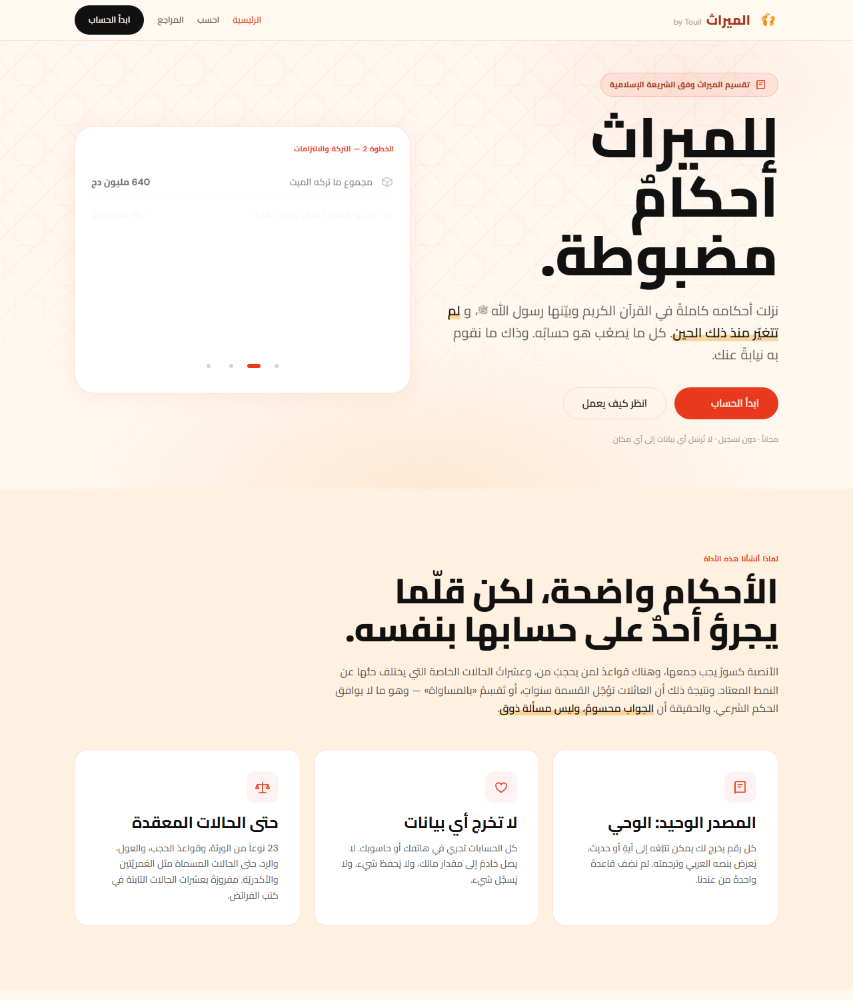
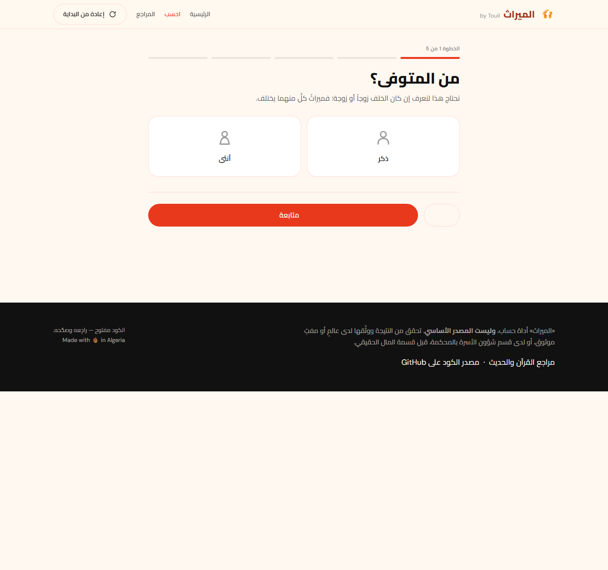
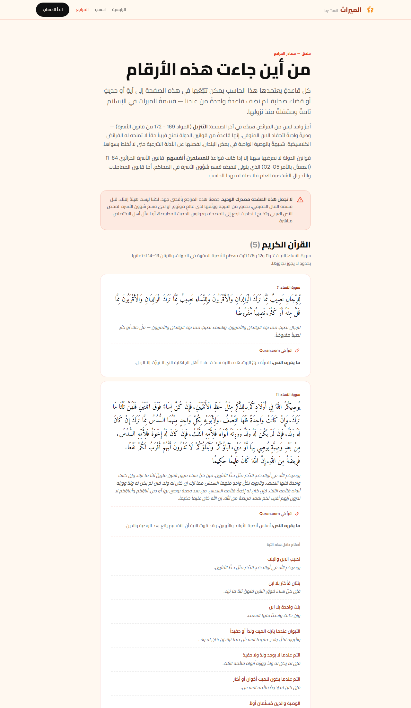
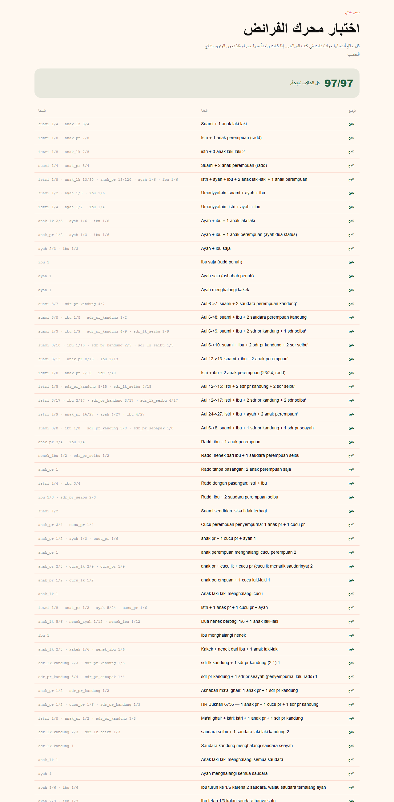

<p align="center">
  
</p>

<h1 align="center">الميراث</h1>

<p align="center">
  <em>حاسبة تقسيم التركة وفق الشريعة الإسلامية — باللغة العربية</em>
  <br>
  <b>by Touil</b>
</p>

<div align="center">

> موقع ثابت يحسب توزيع الميراث وفق القرآن والسنة وأحكام قانون الأسرة الجزائري.
> يُحسب كل شيء في متصفحك؛ لا تُرسل أي من بياناتك إلى أي مكان.

</div>

---

أحكام الميراث في الإسلام **مضبوطة ومغلقة** — قرّرها القرآن في سورة النساء (الآيات 7 و11 و12 و176)
بالإضافة إلى أحاديث صحيحة، ولم تتغيّر منذ نزولها. ما يجعل العامّي لا يستطيع تطبيقها ليس غموض
الحكم، بل **حساباته**: الكسور التي يجب جمعها، جدول الحجب (من يُسقط من)، وعشرات الحالات الخاصة
المعروفة في علم الفرائض. هذا الموقع يسدّ تلك الفجوة.

---

## لقطات من الموقع

<p align="center">
  
  <br>
  <small>الصفحة الرئيسية مع العرض التوضيحي المتحرك</small>
</p>

<p align="center">
  
  <br>
  <small>معالج الإدخال — المتوفى، المال، قائمة الورثة أو شجرة العائلة</small>
</p>

<p align="center">
  
  <br>
  <small>صفحة المراجع — أدلة القرآن والحديث لتقسيم الميراث</small>
</p>

<p align="center">
  
  <br>
  <small>97 حالة اختبار بأجوبة ثابتة في كتب الفرائض</small>
</p>

---

## المميزات

- **طريقتان لإدخال الورثة:** قائمة سريعة بخانات `+/−`، أو شجرة عائلة دقيقة تُبنى كما هي فعلًا.
- **نتيجة كاملة موثّقة:** كلّ وَرِثة يرى نصيبه كعددٍ وكنسبة، مع كسرٍ غير قابل للاختزال
  واسمٍ مختصر (فرض / تعصيب / حجب).
- **دليل لكل رقم:** كل جزء قابل للفك لمعرفة دليله — نص الآية أو الحديث كاملًا، ترجمته، درجته،
  ورابط مصدره.
- **خطوات تالية حسب حالة العائلة:** قائمة مهام تتكيَّف مع حالتك — من شهادة الإرث إلى عقد القسمة
  عند الموثّق وحفظ الملكية العقارية.
- **حساب التركة بالترتيب الصحيح:** تجهيز الجنازة ← سداد الديون ← تنفيذ الوصايا ← ثم توزيع الباقي.
- **عملة الدينار الجزائري (دج)** بتنسيق عربي كامل (<code>1.234.567 دج</code>).
- **إخراج PNG وPDF** للقسمة مع نصٍّ عربي واضح.
- **تصميم متجاوب** أولًا (mobile-first) وبدون أي اعتماديات خارجية قيد التشغيل.

---

## شاشتان تختصران الفكرة

### إدخال الشجرة، وتحرير مباشر

على عكس القوائم المجرّدة، ترسم الشجرة القرابة كما هي: الحفيد يُضاف من داخل بطاقة ابنه، وابن
الأخ من داخل بطاقة أخيه — فلا تُترك العلاقة للتخمين. هذا هو الفرق بين حفيد الابن (يرث) وحفيد
البنت (لا يرث). كل من في الشجرة قابل للتعديل: الجنس، الحال، الوضع، أو إضافة ولدٍ تحته — ويتحدث
الحساب بالكامل فورًا.

### دليل الحكم بجانب كل رقم

الفقه ليس مربعًا أسود: كلّ من حصل على نصيب يستطيع فتح بطاقة «لماذا؟» ليرى النص الكامل للآية
أو الحديث بترجمته مع درجة صحته ورابطٍ يمكن التحقق منه بنفسه.

> أصلٌ تحريري: **الآية لا تُقتطع أبدًا.** تُعرض الآية كاملة حتى جملتها الختامية، ثم يُسلَّط
> الضوء على المقطع الذي يقرّر نصيب من تُقرأ بطاقته ويُبهَّت الباقي — فالقارئ يرى كلام الله
> كاملًا بلا توهين.

---

## القرآن والسنة، وقانون الأسرة الجزائري

المرجع الرئيسي للحاسبة هو القرآن الكريم والسنة النبوية. وبما أن الأداة موجهة للجزائر، أُضيف
خيارٌ عند النتيجة لتبديل ما يظهر بين:

| الخيار | ماذا يحدث |
|---|---|
| **القرآن والسنة** | النتيجة وحدها، أنصبة الشريعة مباشرة. |
| **مع القانون الجزائري** | تُعرض ملاحظات قانونية بجانبها من قانون الأسرة (الأمر 84‑11 وتعديله بالأمر 05‑02)، مثل التنزيل (المواد 169–172)، وحالات العول والرد (166–168)، وقواعد الملكية بين الزوجين (المواد 37–38). |

الأنصبة المقرّرة شرعًا لا تتغيّر؛ القانون الجزائري يُستشهد به في نصوصه ويُربط بمصادره، ويُعلَّم
بوضوح على أنه كلامٌ قانوني وليس دليلًا شرعيًا.

---

## العقيدة المشروحة في الحساب: ترتيب التركة

1. **تجهيز الميت** (تكفين ونحو ذلك) من ماله.
2. **الديون** المستحقة على الميت.
3. **الوصايا** في حدود الثلث.
4. الباقي = **التركة الصافية × توزّع على الورثة** بالأنصبة الشرعية.

الحاسبة تتعامل مع كل هذه البنود، وتُظهر بجانب كل مقطع “لماذا” موثّقًا.

---

## التشغيل

لا توجد خطوة بناء، ولا اعتماديات، ولا npm.

```bash
python3 -m http.server 8123
```

ثم افتح <http://localhost:8123>. للنشر في الإنتاج، ارفع المجلد كاملًا كما هو إلى أي استضافة
ثابتة (GitHub Pages, Netlify, Vercel, cPanel).

---

## بنية المشروع

```
index.html              الصفحة الرئيسية + عرض توضيحي متحرك
hitung.html             معالج الإدخال ونتيجته
rujukan.html            المراجع — كل أدلة القرآن والسنة
tests.html              اختبار محرك الفرائض — يُفتح في المتصفح

css/
  tokens.css            نسخة حرفية من touil-design-system
  base.css              إعادة تهيئة، شريط التنقل، التذييل، الأزرار، البطاقات
  app.css               المعالج، المخطط الدائري، سجلّ الأرقام، بطاقات النتائج
  rtl.css               اتجاه من اليمين إلى اليسار والمحاذاة العربية
  print.css             تخطيط الطباعة / الحفظ كـ PDF

js/faraid/              محرك الحساب — نقي، بلا أي تعامل مباشر مع DOM
  fraction.js           حساب الكسور بالأعداد الصحيحة
  heirs.js              تعريف الورثة (23 وَرِثًا)
  hijab.js              قواعد الحجب
  shares.js             الأنصبة المقرّرة (أصحاب الفروض)
  ashabah.js            توزيع الباقي (التعصيب)
  special.js            العُمَريّتان، الأكدرية، المُشتركة، الجدّ مع الإخوة
  estate.js             التركة: الملكية بين الزوجين، تجهيز، ديون، وصايا
  solve.js              المنسّق + العول والرد

js/
  dalil.js              بيانات الآيات والأحاديث (ثابتة، محلّلة)
  khi.js                ملاحظات قانون الأسرة الجزائري
  advice.js             الخطوات التالية للعائلة
  keluarga.js           نموذج بنية العائلة + استخراج قائمة الورثة
  ui-pohon.js           مخطط شجرة العائلة
  ui-pohon-edit.js      تحرير الشجرة (شريط الإضافة + ورقة التعديل)
  ui-*.js               بقية طبقات العرض
  export.js             PNG (canvas) و PDF (حوار الطباعة)
  tests.js              97 حالة اختبار
```

---

## نموذج بنية العائلة

يحفظ `js/keluarga.js` **بنية** الأسرة لا أرقامًا: الحفيد يلتصق بابنه، ابنُ الأخ بأخيه، ابنُ
العمّ بعمّه. تُشتق قائمة الورثة من تلك البنية عبر `keAhliWaris()`.

ليست المسألة تنظيمية فقط. مثالٌ حقيقي دفع إلى هذا التغيير: أمٌّ توفيت عن ثلاث بنات لكلٍّ منهنّ
أبناء. لو أُدخل «الأحفاد» في خانات منفصلة لظنّت الحاسبة أنهم أحفاد من ابن (الأحفاد الوحيدون
الذين يرثون) فاستنتجت خطأً وجود ابنٍ توفي قبلها — والنتيجة حينها حفيدٌ يأخذ 1/13 وأختٌ تُحجب،
مع أن الصحيح أن الحفيد لا حقّ له أصلًا وتأخذ الأخت 1/12. بالنموذج البنيوي يُرسم حفيدُ البنت كما
هو ويُعلَّم «ليس ورِثة». وينطبق ذلك على الأخوال وأولادِ العَمّات وما إليه.

### أولادٌ مختلفة الأحكام

| الحالة | يرث؟ | ملاحظة |
|---|---|---|
| الابن/البنت (نَسَب) | نعم | من كانت له ولدٌ ينسب إليه، ولو من زواج سابق — لا ينقطع النسب. |
| الربيب (ولَدُ الزوجة/الزوج) | لا | ميراثٌ من أبيه الحقيقي وحده. الطريق: هبةٌ في الحياة أو وصية بالثلث (لأجنبي). |
| المكفول (كَفالة) | لا | الكفالة لا تنقل النسب؛ ينتفع إن شاء الميت بهبةٍ أو وصية — وهي مضبوطة في قانون الأسرة (مواد الكفالة). |

---

## الاختبارات

يشغّل `tests.html` **97 حالة** أجوبتها مقرّرة في علم الفرائض. إذا حمرت حالةٌ واحدة، فنتائج
الحاسبة لا تُصدَّق.

يمكن أيضًا من الطرفية:

```bash
node -e "['faraid/fraction','faraid/heirs','faraid/hijab','faraid/shares','faraid/ashabah','faraid/special','faraid/estate','faraid/solve','keluarga','dalil','tests'].forEach(m=>require('./js/'+m+'.js'));const h=Tests.jalankan();const g=h.filter(x=>!x.lulus);g.forEach(x=>console.log('GAGAL',x.nama,x.pesan));console.log(h.length-g.length+'/'+h.length+' lulus')"
```

النتيجة المتوقعة: `97/97 lulus`.

تشمل الحالات: مستويات العول كاملة (6→7/8/9/10، 12→13/15/17، 24→27)، الردُّ مع الزوجين وبدونهما،
الحالات الخاصة المُسمّاة، قواعد الحجب، حساب التركة، واستخراج قائمة الورثة من بنية العائلة —
بما فيها من سقط لموته قبل المورِّث، والكفالة، والتحقق من أن الدليل الملصق بجزءٍ يتحدث فعلًا
عن ذلك الوارث.

---

## ما لا تُحسبه الأداة

بعض المسائل تقتضي حكمَ إنسانٍ، فتُصرَّح بها الأداة وتوجّه إلى عالمٍ موثوق أو قسم شؤون الأسرة
بالمحكمة:

- الجنين في بطن أمه (يُرجى ميراثه إن وُلد حيًّا دون أن يؤثر بالعول إذا مات).
- الوارث المفقود (الخنا في المفقود) والخنثى المشكِل.
- ذوو الأرحام (الأقارب خارج الورثة الثلاثة والعشرين).
- الجدّ مع الإخوة، المالكية قد **لا يُحجب** الأخ الشقيق ولا الأخ لأب، وإنما جهات نوعان تُعالج
  منهما حالتان؛ «المُعادة» تُعلَّم أنها تحتاج استشارة.

---

## الخصوصية

لا طلبات شبكة غير خطوط Google Fonts. لا يوجد `fetch` ولا `XMLHttpRequest` ولا `localStorage`
ولا `sessionStorage` ولا أي ملف تعريف عبر الكود كله. كل الحسابات تجري في متصفح المستخدم؛ وخرج
PNG يُرسم مباشرة إلى `<canvas>`، وخرج PDF عبر حوار الطباعة في المتصفح — كلهما بلا مكتبات طرف
ثالث وبلا إرسال أي شيء إلى الخارج.

إن أردت الاستغناء حتى عن الخطوط الخارجية، استضف خطوطك بنفسك (Cairo + Amiri) وغيّر سطر
`@import` في `css/tokens.css`.

---

## قبل النشر

**`js/dalil.js` يحتاج مراجعةً واحدة من عالمٍ متخصص في الفرائض** — نص عربي، ترجمة، أرقام أحاديث،
ودرجات صحتها. المنطق الحسابي يمكن إثباته باختبارات؛ أما صحة الاستشهادات فلا، وهي من أمر الدين.

كل اقتباس طُوبق واحدًا واحدًا مع المصادر المتاحة، وكل مدخل يحفظ رابطَ مصدره حتى يتحقق القارئ
بنفسه. هذه المطابقة تضمن صحة الرقم والنص، لكنها لا تغني عن مراجعة الخبير — ولا سيما لدرجة
الأحاديث، التي يختلف فيها أهل العلم.

> تنبيه لمن يضيف دليلًا لاحقًا: **أرقام الأحاديث تختلف بين الناشرين.** ارفق دائمًا رابط المصدر،
> ولا تكتفِ بالرقم.

---

## المساهمة

المسألة تتعلق بالفقه وأموال العائلات؛ لذلك نُشر الكود قصدًا لكي يراجعه من شاء — لا ليكون موضع
ثقةٍ أعمى.

**الأكثر احتياجًا:**

1. **تصحيح الأدلة** من أهل الفرائض — أرقام أحاديث، تخريج، ترجمة، أو اقتباس خاطئ في
   `js/dalil.js` و `rujukan.html`.
2. **حالات اختبار جديدة** من كتب الفرائض أو أحكام المحاكم — تُضاف إلى `js/tests.js` مع
   جوابها المقرّر ومصدرها.
3. **تقارير أخطاء الحساب** — مع قائمة الورثة كاملة لإعادة إنتاج المسألة.
4. **المسائل غير المدعومة** — خصوصًا «المُعادة» التي تُعلَّم حاليًا أنها بحاجة إلى استشارة.

لا يشترط إجادة البرمجة: افتح *Issues* واكتب بلغة عادية — المطلوب العلم لا الكود.

- **قضايا GitHub** — <https://github.com/touilfarouk/elmirat/issues>
- **البريد** — <farouktouil@gmail.com>
- **LinkedIn** — [farouk-touil](https://www.linkedin.com/in/farouk-touil-02778592/)

**قبل إرسال تغيير على محرك الفرائض:** شغّل الاختبارات وتأكد من بقاء كل الحالات خضراء. وإذا
غيّرت سلوك الحساب، أضف حالةً تبرهن أن تغييرك صحيح.

**تذكير بإصدارات الأصول:** كل المراجع في css و js تحمل وسم `?v=N`. ارفع الرقم في كل إصدار
يغيّر css أو js، حتى لا يحصل القدامى على ملفات قديمة من الذاكرة المؤقتة.

---

## الترخيص والأصول

الملفات في `assets/` (علامة الزهرة وتميمة Flav) أصولٌ تخص **Touil** ولا يُقصد إعادة استخدامها
خارج هذا المشروع. إن أردت استخدام كود محرك الفرائض، فاستبدل الأصول والتسميات أولًا.

لا يوجد ملف LICENSE بعد — أي أن حقوق التأليف بحوزة مالك المستودع بالكامل. إن أردت فتحه
للعموم، أضف الترخيص المناسب (مثل MIT للكود مع استثناء الأصول).

---

## إخلاء المسؤولية

هذه أداة حساب، **وليست المصدر الأساسي**. تحقق من النتيجة ووثّقها لدى عالمٍ أو مفتٍ موثوق، أو
لدى قسم شؤون الأسرة بالمحكمة، قبل قسمة المال الحقيقي. محتوى `js/dalil.js` و `rujukan.html`
بحاجة إلى مراجعة خبير فرائض مرةً واحدة قبل نشر الموقع.